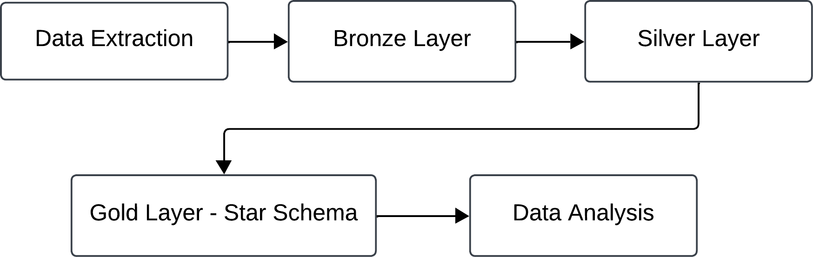
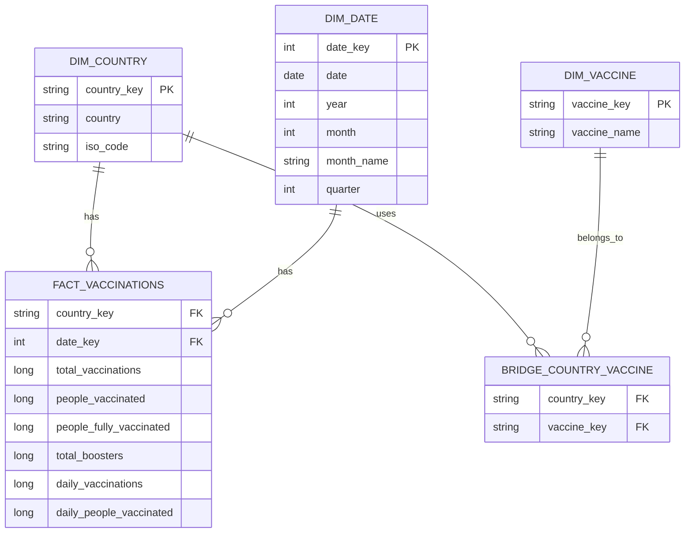
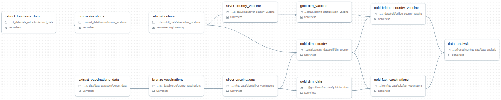

# COVID-19 Vaccination Data Pipeline

This project implements a Databricks data engineering pipeline to analyze COVID-19 vaccination data from two different source formats:

- `locations.csv`
- `vaccinations.json`

The solution was built using PySpark, Delta tables, Medallion Architecture, Lakeflow Jobs orchestration, and a Gold-layer dimensional model based on a star schema approach.

## Project Goals

The pipeline answers the following business questions:

1. What country or countries use the highest number of different vaccine types?
2. What are the top 10 countries with the highest number of vaccinations per month and year?
3. For each year, what are the top 10 countries considering the number of vaccine types used and the number of vaccinations, including the full list of vaccines used by each country?

The answers are implemented in the `data_analysis.ipynb` notebook/script and are calculated using only the curated Gold-layer tables.

## Architecture Overview

The project follows the Medallion Architecture:

<div align="center">
  
</div>

### Setup Notebook

A setup notebook/script was implemented to create the necessary Databricks resources before running the pipeline.

The setup step creates:

- The `covid_19` catalog
- The `bronze`, `silver`, and `gold` schemas
- The `covid_19.bronze.raw_data` volume used to store the extracted raw files

This makes the project reproducible and avoids requiring manual resource creation in the Databricks UI.

## Data Extraction Strategy

The data is extracted using Python `requests` instead of manual download and upload.

This choice was made to keep the pipeline automated and reproducible. The extraction task downloads the files directly from the public OWID GitHub URLs and stores them in the Databricks volume:

```text
/Volumes/covid_19/bronze/raw_data/
```

The extraction step supports both source files:

- `locations.csv`
- `vaccinations.json`

This avoids manual operational steps and makes the pipeline easier to schedule using Lakeflow Jobs.

## Medallion Layers

### Bronze Layer

The Bronze layer stores the raw source data as Delta tables with minimal transformation.

Tables:

```text
covid_19.bronze.locations
covid_19.bronze.vaccinations
```

Main decisions:

- Explicit schemas are used instead of relying on schema inference.
- `locations.csv` is read as a structured CSV file.
- `vaccinations.json` is read using `multiLine = true` because the file contains a nested JSON structure.
- An `ingestion_timestamp` column is added to support traceability.

### Silver Layer

The Silver layer cleans and normalizes the data.

Tables:

```text
covid_19.silver.locations
covid_19.silver.country_vaccine
covid_19.silver.vaccinations
```

Main transformations:

- `locations.csv` is standardized by renaming `location` to `country`.
- The comma-separated vaccine list is split into an array.
- The vaccine array is exploded into a normalized country-vaccine table.
- The nested `data` array from `vaccinations.json` is exploded into one row per country and date.
- Vaccination metrics are cast to numeric types.
- Invalid aggregate location values such as `World`, `Europe`, `Asia`, income groups, and continents are removed from the vaccination dataset to keep the analysis focused on countries.

### Gold Layer

The Gold layer implements the dimensional model used for reporting and analytics.

Tables:

```text
covid_19.gold.dim_country
covid_19.gold.dim_date
covid_19.gold.dim_vaccine
covid_19.gold.bridge_country_vaccine
covid_19.gold.fact_vaccinations
```

The business questions are answered from these Gold tables only.

## Why Star Schema?

A star schema was selected because it is a strong fit for analytical workloads, dashboards, and BI tools such as Power BI and Tableau.

This modeling approach makes the data easier to consume because it separates descriptive entities, such as country, date, and vaccine, from measurable vaccination facts.

Benefits of this approach:

- Easier dashboard implementation
- Clear separation between facts and dimensions
- Better support for slicing and filtering by country, date, year, month, and vaccine
- Easier reuse of the same curated Gold tables for multiple analyses
- More understandable model for business users and BI developers

## Dimensional Model

The central fact table is `fact_vaccinations`, which has the grain:

```text
One row per country per date
```

The dimensions provide descriptive context:

- `dim_country`: country and ISO code
- `dim_date`: date, year, month, month name, and quarter
- `dim_vaccine`: vaccine names

Because countries can use many vaccines and the same vaccine can be used by many countries, the model includes a bridge table:

- `bridge_country_vaccine`

This resolves the many-to-many relationship between countries and vaccines.

## ER Diagram



## Gold Table Design Decisions

### Deterministic Surrogate Keys

The dimension keys are generated using hash functions instead of non-deterministic IDs.

Examples:

- `country_key` is generated from `iso_code`
- `vaccine_key` is generated from the normalized vaccine name
- `date_key` uses the `yyyyMMdd` format

This keeps the dimension keys stable across pipeline runs, since the same source values always generate the same surrogate keys.

### Bridge Table for Vaccines

The vaccine information is not stored directly in the vaccination fact table because the source does not provide vaccine-level daily vaccination counts.

Instead, vaccine usage is modeled as a country-level relationship through `bridge_country_vaccine`.

This avoids incorrectly duplicating vaccination metrics by vaccine and keeps the fact table grain accurate.

### Additive Metric for Aggregations

The analysis uses `daily_vaccinations` for monthly and yearly aggregations because it is additive across dates.

Metrics such as `total_vaccinations` are cumulative and should not be summed across multiple days.

## Lakeflow Jobs Orchestration

The pipeline was designed to be orchestrated with Lakeflow Jobs. The Job can be generated by running the notebook located at:

`setup/create_lakeflow_job.ipynb`

The job follows the dependency order below:



The final analysis task depends on the Gold fact table and the country-vaccine bridge table, ensuring that all answers are produced only after the complete analytical model is available.

## Data Analysis Notebook

The answers to the proposed questions are available in:

```text
data_analysis.ipynb
```

This notebook/script reads from the Gold layer only:

```text
covid_19.gold.dim_country
covid_19.gold.dim_date
covid_19.gold.dim_vaccine
covid_19.gold.bridge_country_vaccine
covid_19.gold.fact_vaccinations
```

### Question 1

Countries with the highest number of vaccine types are calculated using:

```text
dim_country
bridge_country_vaccine
dim_vaccine
```

### Question 2

Top 10 countries by vaccinations per month and year are calculated using:

```text
fact_vaccinations
dim_country
dim_date
```

The result is ranked by `monthly_vaccinations` for each year and month.

### Question 3

Top 10 countries by year including all vaccines are calculated using:

```text
fact_vaccinations
dim_country
dim_date
bridge_country_vaccine
dim_vaccine
```

The ranking is applied per year using the following ordering:

1. Highest number of vaccine types used
2. Highest number of yearly vaccinations

This interpretation follows the requirement to order the top 10 first by most vaccine types used and then by most vaccinated in the year.

## Project Structure

```text
ntt_data-challenge/
  setup/
    create_resources.ipynb
    create_lakeflow_job.ipynb
  
  images/
    lakeflow_job.png
    medallion-archicteture.png

  data_extraction/
    extract_data.ipynb

  bronze/
    bronze_locations.ipynb
    bronze_vaccinations.ipynb

  silver/
    silver_locations.ipynb
    silver_country_vaccine.ipynb
    silver_vaccinations.ipynb

  gold/
    dim_country.ipynb
    dim_date.ipynb
    dim_vaccine.ipynb
    bridge_country_vaccine.ipynb
    fact_vaccinations.ipynb

  data_analysis.ipynb
```

## Summary

This project implements a complete PySpark data pipeline using Databricks and Delta tables. The solution avoids manual data handling by extracting source files through Python requests, organizes the data using the Medallion Architecture, and exposes a Gold-layer star schema designed for BI, dashboards, and analytical queries.

The final answers are intentionally based only on the Gold layer to simulate a real production analytics architecture where consumers should not query raw or intermediate data directly.
